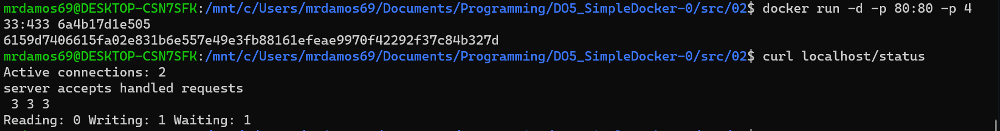
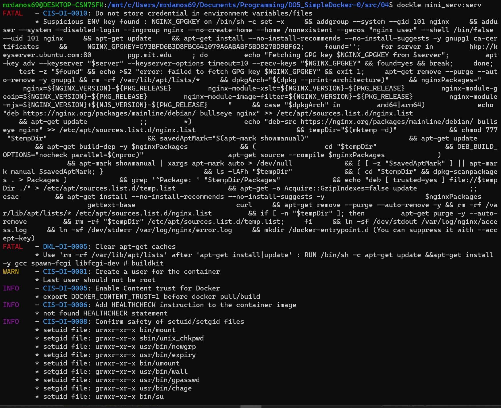
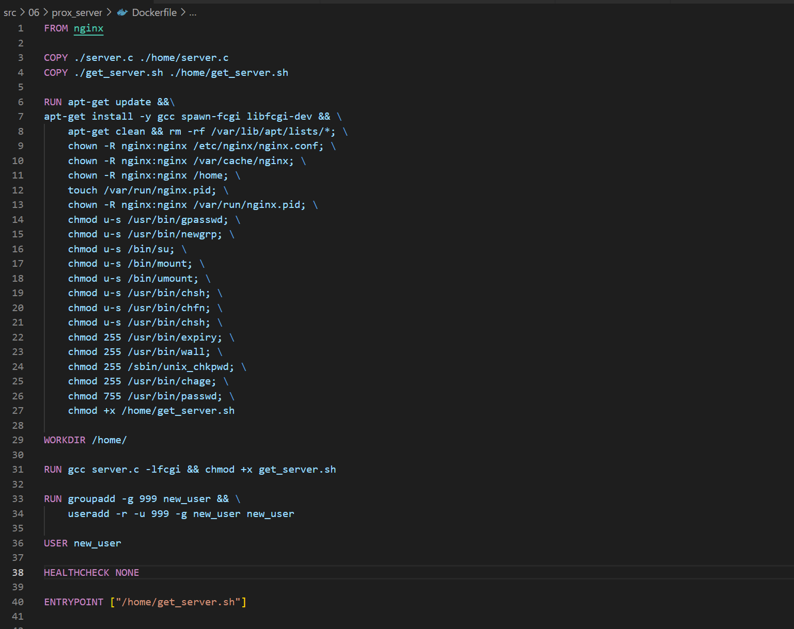

# Simple Docker отчет brittabu

## Part 1. Готовый докер

##### Берем официальный докер образ с **nginx** и выкачать его при помощи `docker pull`

##### Проверяем наличие докер образа через `docker images`

##### Запускаем докер образ через `docker run -d [image_id|repository]`

##### Проверяем, что образ запустился через `docker ps`

##### Смотрим информацию о контейнере через `docker inspect [container_id|container_name]`

##### По выводу команды определяем размер контейнера, список замапленных портов и ip контейнера

##### Останавливаем докер образ через `docker stop [container_id|container_name]` и проверяем что образ остановился через `docker ps`

##### Запускаем докер с замапленными портами 80 и 443 на локальную машину через команду *run*

##### Проверяем, что в браузере по адресу *localhost:80* доступна стартовая страница **nginx**

##### Перезапускаем докер контейнер через `docker restart [container_id|container_name]` и проверяем, что контейнер запустился

## Part 2. Операции с контейнером

##### Открытие конфигурационного файла *nginx.conf* внутри докер контейнера через команду *exec*

##### Создаем на локальной машине файл *nginx.conf* и настраиваем в нем по пути */status* отдачу страницы статуса сервера **nginx**

##### Копируем созданный файл *nginx.conf* внутрь докер образа через команду `docker cp`

##### Перезапускаем **nginx** внутри докер образа через команду *exec*

##### Проверяем, что по адресу *localhost:80/status* отдается страничка со статусом сервера **nginx**

##### Экспортируем контейнер в файл *container.tar* через команду *export* и останавливаем контейнер

##### Удаляем образ через `docker rmi [image_id|repository]`, не удаляя перед этим контейнеры

##### Удаляем остановленный контейнер

##### Импортируем контейнер обратно через команду *import*

##### Запускаем импортированный контейнер

##### Проверяем, что по адресу *localhost:80/status* отдается страничка со статусом сервера **nginx**

## Part 3. Мини веб-сервер

##### Для того что бы написать мини сервер на **C** и **FastCgi**, который будет возвращать простейшую страничку с надписью `Hello World!` нам необходимо:

##### Скачать офицальный докер образ с **nginx** и выкачать его при помощи `docker pull` и запустить его через `docker run -d [image_id|repository]`

##### Пишем свой сервер мини сервер на **C**. Используем для этого библиотеку *fcgi_stdio.h*

##### Пишем свой *nginx.conf*, который будет проксировать все запросы с 81 порта на *127.0.0.1:8080*.

##### Отправляем `server.c` и `nginx.conf` в наш запущенный контейнер и входим в него

##### Для того что бы у нас все успешно запустилось гам нужно установить в наш контейнер компилятор gcc и все необходимое для библиотеки *fcgi*
 

##### Запускаем написанный мини сервер через *spawn-fcgi* на порту 8080

##### Проверяем, что в браузере по *localhost:81* отдается написанная вами страничка

## Part 4. Свой докер

##### 1) указываем нужный нам родительский образ (в нашем случае `nginx`)
##### 2) копируем внутрь образа написанный *./nginx/nginx.conf*
##### 3) скачиваем компилятор `gcc`,  утилиту `spawn-fcgi` и библиотеку `libfcgi-dev`
##### 4) указваем порты, входим в директорию `home` и даем права доступа для нашего файла `nginx.conf`
##### 5) запускает скрипт.

##### 1) компилируем файл
##### 2) запускаем скомпелированный файл с портом `8080`
##### 3) запускаем службу `nginx`

##### `nginx.config`

##### Собираем написанный докер образ через `docker build` при этом указав имя и тег. Проверяем через `docker images`, что все собралось корректно

##### 1) Запускаем собранный докер образ с маппингом 81 порта на 80 на локальной машине и маппингом папки *./nginx* внутрь контейнера по адресу, где лежат конфигурационные файлы **nginx**'а
##### 2) Проверяем, что по localhost:80 доступна страничка написанного мини сервера

##### Дописываем в *./nginx/nginx.conf* проксирование странички */status*, по которой надо отдавать статус сервера **nginx**

##### 1) Перезапускаем докер образ
##### 2) Проверяем, что теперь по *localhost:80/status* отдается страничка со статусом **nginx**

## Part 5. **Dockle**

После написания образа никогда не будет лишним проверить его на безопасность.

**== Задание ==**
##### Устанавливаем `homebrew` и затем `dockle`

##### Сканируем образ из предыдущего задания через `dockle [image_id|repository]`

##### Исправляем образ

##### Проверяем через **dockle** не было ошибок и предупреждений

## Part 6. Базовый **Docker Compose**

##### Берем за основу докер из [Части 5](#part-5-инструмент-dockle) и копируем его в папку ./prox_server редактируем его и удаляем лишнее:

##### Dockerfile:

##### get_server.sh:

##### Берем за основу докер из [Части 5](#part-5-инструмент-dockle) копируем его в папку ./nginx_server и редактируем что бы он проксировал все запросы с 8080 порта на 81 порт первого контейнера:
##### Dockerfile:

##### nginx.cong:

##### Пишем файл *docker-compose.yml*:

##### Собираем и запускаем проект с помощью команд `docker-compose build` и `docker-compose up`. Затем проверяем, что в браузере по *localhost:80*
##### localhost:80

##### localhost/status

